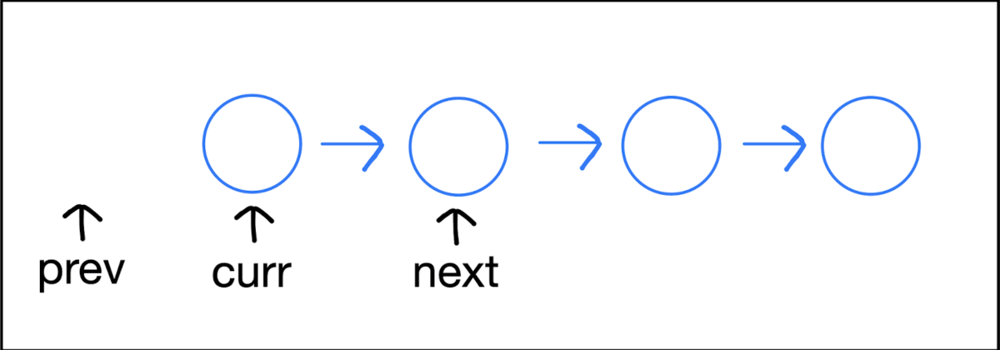

---
layout:
  title:
    visible: true
  description:
    visible: false
  tableOfContents:
    visible: true
  outline:
    visible: true
  pagination:
    visible: true
---

# 題目選解

### 快慢指標

#### [Middle of the Linked List](https://leetcode.com/problems/middle-of-the-linked-list/)

這題就是基本的找中點問題，終止條件是 `fast && fast->next`。這是因為我們只需要檢查快指針是否已經到達鏈表的末尾或者是即將到達末尾。當快指針或其下一個節點是 `nullptr` 時，表示已到達末尾，此時慢指針恰好在中點。

```cpp
/**
 * Definition for singly-linked list.
 * struct ListNode {
 *     int val;
 *     ListNode *next;
 *     ListNode() : val(0), next(nullptr) {}
 *     ListNode(int x) : val(x), next(nullptr) {}
 *     ListNode(int x, ListNode *next) : val(x), next(next) {}
 * };
 */
class Solution {
public:
    ListNode* middleNode(ListNode* head) {
        ListNode *fast = head, *slow = head;
        while (fast && fast->next) {
            fast = fast->next->next;
            slow = slow->next;
        }
        return slow;
    }
};
```

#### [Linked List Cycle](https://leetcode.com/problems/linked-list-cycle/description/)

這題是基本的判斷有沒有環問題，終止條件是 `fast->next && fast->next->next`。這是因為快指針每次移動兩步，我們需要確保這兩步都是有效的（即指針不會指向 `nullptr`）。如果快指針或其下一個節點是 `nullptr`，這意味著鏈表結尾已經到達，並且鏈表中沒有環。

```cpp
/**
 * Definition for singly-linked list.
 * struct ListNode {
 *     int val;
 *     ListNode *next;
 *     ListNode(int x) : val(x), next(NULL) {}
 * };
 */
class Solution {
public:
    bool hasCycle(ListNode *head) {
        if (!head) return false;
        ListNode *fast = head, *next = head;
        while (fast->next && fast->next->next) {
            slow = slow->next;
            fast = fast->next->next;
            if (slow == fast) return true;
        }
        return false;
    }
};
```

#### [Linked List Cycle II](https://leetcode.com/problems/linked-list-cycle-ii/)

這題我們可以利用上一題的 code，先判斷有沒有環，如果有的話，再來找起始點。

當我們確定鏈表中存在環後，我們可以使用一個巧妙的方法來找到環的起始節點。這個方法基於以下幾個觀察：

1. **相遇點**：當快指針（每次兩步）和慢指針（每次一步）在環內相遇時，它們已經走過了不同的路徑長度。設鏈表開始到環起點的距離是 `D`，環起點到相遇點的距離是 `S`，環的長度是 `C`。此時，快指針走過的距離是 `D + S + nC`（其中 `n` 是快指針在環中的圈數），慢指針走過的距離是 `D + S`。
2. **距離關係**：由於快指針是慢指針速度的兩倍，所以它們走過的路徑長度也有著兩倍的關係，即 `2(D + S) = D + S + nC`。經過簡化，我們得到 `D = nC - S`。
3. **找到環的起點**：上面的等式告訴我們，從頭節點到環的起點的距離 `D` 等於從相遇點繼續走 `nC - S` 步。因為環的長度是 `C`，所以 `nC - S` 實際上就是從相遇點走到環起點的距離。這意味著，如果我們從鏈表的頭節點和相遇點同時以相同的速度（每次一步）前進，兩個指針將在環的起始節點相遇。

因此，算法的第二部分是將快指針重置到頭節點，然後讓快慢指針都以相同的速度前進。當它們相遇時，它們都走了 `D` 步，這個相遇點就是環的起始節點。

```cpp
/**
 * Definition for singly-linked list.
 * struct ListNode {
 *     int val;
 *     ListNode *next;
 *     ListNode(int x) : val(x), next(NULL) {}
 * };
 */
class Solution {
public:
    ListNode *detectCycle(ListNode *head) {
        ListNode *fast = head, *slow = head;
        while (fast and fast->next)
        {
            fast = fast->next->next;
            slow = slow->next;
            if (slow == fast)
            {
                break;
            }
        }
        if (slow != fast)
        {
            return NULL;
        }
        
        fast = head;
        while (fast and fast->next)
        {
            if (fast == slow)
            {
                return fast;
            }
            fast = fast->next;
            slow = slow->next;
        }
        
        return NULL;
    }
};
```

### 其他

#### [Merge Two Sorted Lists](https://leetcode.com/problems/merge-two-sorted-lists/)

使用遞迴方法合併兩個鏈表。每次比較兩個鏈表頭部的值，並將較小的值作為合併後鏈表的下一個節點，然後對剩餘部分進行遞迴操作。

```cpp
class Solution {
public:
    ListNode* mergeTwoLists(ListNode* l1, ListNode* l2) {
        if (!l1) return l2;
        if (!l2) return l1;
        if (l1->val < l2->val) {
            l1->next = mergeTwoLists(l1->next, l2);
            return l1;
        } else {
            l2->next = mergeTwoLists(l1, l2->next);
            return l2;
        }
    }
};
```

#### [Merge k Sorted Lists](https://leetcode.com/problems/merge-k-sorted-lists/)

我們可以把問題分解為多次合併兩個排序鏈表。每一次迭代都將鏈表數量減半，通過不斷合併對應的鏈表對，最終合併所有鏈表。

```cpp
class Solution {
public:
    ListNode* mergeKLists(vector<ListNode*>& lists) {
        if (lists.empty()) return nullptr;
        int n = lists.size();
        while (n > 1) {
            for (int i = 0; i < n / 2; i++) {
                lists[i] = mergeTwoLists(lists[i], lists[n - 1 - i]);
            }
            n = (n + 1) / 2;
        }
        return lists.front();
    }

private:
    ListNode* mergeTwoLists(ListNode* l1, ListNode* l2) {
        if (!l1) return l2;
        if (!l2) return l1;
        if (l1->val < l2->val) {
            l1->next = mergeTwoLists(l1->next, l2);
            return l1;
        } else {
            l2->next = mergeTwoLists(l1, l2->next);
            return l2;
        }
    }
};

```

#### [Remove Nth Node From End of List](https://leetcode.com/problems/remove-nth-node-from-end-of-list/)

使用兩個指針，第一個指針先向前移動 n+1 步，然後兩個指針一起移動。當第一個指針到達末尾時，第二個指針指向要刪除節點的前一個節點。

```cilkcpp
class Solution {
public:
    ListNode* removeNthFromEnd(ListNode* head, int n) {
        ListNode dummy(0);
        dummy.next = head;
        ListNode *first = &dummy, *second = &dummy;
        for (int i = 0; i <= n; i++) {
            first = first->next;
        }
        while (first) {
            first = first->next;
            second = second->next;
        }
        second->next = second->next->next;
        return dummy.next;
    }
};

```

#### [Reverse Nodes in k-Group](https://leetcode.com/problems/reverse-nodes-in-k-group/)

這一題我覺得翻轉稍難一點，所以先大概解釋整個架構，翻轉的部分希望看 gif 可以懂。

先算出所有的節點數，然後每 $$k$$ 個翻轉一次，最後剩餘的就不理他。

這邊假設 $$k = 3$$ 畫的 while 迴圈 gif。

<figure><figcaption></figcaption></figure>

```cpp
class Solution {
public:
    ListNode* reverseKGroup(ListNode* head, int k) {
        ListNode dummy(0);
        dummy.next = head;
        ListNode *prev = &dummy, *curr = head;
        int num = 0;
        while (curr) {
            num++;
            curr = curr->next;
        }
        while (num >= k) {
            curr = prev->next;
            ListNode *next = curr->next;
            for (int i = 1; i < k; i++) {
                curr->next = next->next;
                next->next = prev->next;
                prev->next = next;
                next = curr->next;
            }
            prev = curr;
            num -= k;
        }
        return dummy.next;
    }
};

```

#### [Partition List](https://leetcode.com/problems/partition-list/)

可以開兩個鏈表，一個用於存所有小於 x 的節點，另一個用於存所有大於或等於 x 的節點。遍歷原始鏈表，根據節點值將其分配到這兩個臨時鏈表中，最後將這兩個臨時鏈表連接起來就完成了。

```cpp
class Solution {
public:
    ListNode* partition(ListNode* head, int x) {
        ListNode before_head(0), after_head(0);
        ListNode *before = &before_head, *after = &after_head;
        while (head) {
            if (head->val < x) {
                before->next = head;
                before = before->next;
            } else {
                after->next = head;
                after = after->next;
            }
            head = head->next;
        }
        after->next = nullptr;
        before->next = after_head.next;
        return before_head.next;
    }
};

```
